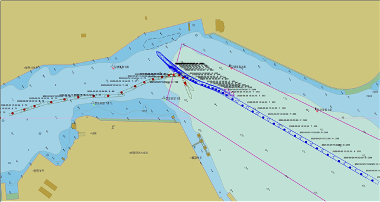

# Collision Sumulator.html 은 예시 결과물입니다.

위 파일의 재결서 정보

부산해심 제2021-012호
석유제품운반선 유성·석유제품운반선 부광1호 충돌사건

해양사고관련자
A(****.**.**.)

---

해양사고관련자

B(****.**.**.)

---

청  구  취  지

「해양사고의 조사 및 심판에 관한 법률」 제38조 제1항의 규정에 의하여 심판을 청구함
관여조사관   김  구  종

주          문

이 충돌사건은 울산항 제2항로로 진입하던 부광1호가 항로를 항행하던 유성을 피하지 아니하여 발생한 것이나, 유성이 적절한 피항협력동작을 취하지 아니한 것도 일인이 된다.
해양사고관련자 B의 3급 항해사 업무를 1개월 정지한다.
해양사고관련자 A를 견책한다.

이      유

1. 사 실

선    명
유성
부광1호
선 적 항
부산광역시
부산광역시
선박소유자
㈜C
D
총 톤 수
1998.00톤
993.00톤
기관종류?출력
디젤엔진 1,912㎾ 1기
디젤기관 1470㎾ 1기
해양사고관련자
A
B
직    명
선장
선장
면허의 종류
3급 항해사(**-**-**-****)

3급 항해사(**-**-**-****)

사고일시
2020. 9. 29. 15:35경
사고장소
북위 35도 30분 05초 · 동경 129도 22분 45초(울산항 제2항로 내)

유성은 2019. 12. 30. 전남 영암군 삼호읍 소재 ㈜유일에서 건조·진수된 총톤수 1998.00톤(길이 79.99미터, 너비 14.00미터, 깊이 7.30미터)의 부산광역시 선적 강조 석유제품운반선으로, 주기관으로 1,912 킬로와트의 디젤기관 1기를 장치하고 있다. 이 선박은 2020. 4. 27. 한국선급으로부터 정기검사를 받고 2025. 4. 26.까지 유효한 선박검사증서를 교부받아 보유하고 있다.

[그림 ] 유성 일반배치도
유성은 2020. 9. 29. 02:30경 이 선박의 선장인 해양사고관련자 A(이하 ‘유성 선장’이라 한다)을 포함한 선원 12명을 태우고 동해항에서 공선 상태로 출항하여, 2020. 9. 29. 13:05경 울산항 M-6 묘박지에 투묘하고 대기하다가, 2020. 9. 29. 15:20경 양묘하여 경질유 적하작업 차 울산 장생포항을 향하였다.
유성은 울산항 제2항로 거의 한 가운데를 침로 약 300도, 속력 약 7.9노트로 항행하면서 울산VTS에서 지정한 채널을 VHF로 듣고 있었다. 그런데 부광1호가 15:33:25경 “유성호! 부광1호입니다. 우짤까예(어떻게 할까요)?”라는 질문을 해왔다. 당시 부광1호는 장생포항을 출항하여 제2항로에 진입하려는 것으로 보였고, 부광1호의 침로는 78도, 속력은 약 10노트였다.
이에 유성은 부광1호에게 “예. 좌현 대 좌현 부탁합니다.”라고 답하였다. 연이어 유성은 울산VTS로부터 “부광1호, 유성호하고 좌현 대 좌현이요.”라는 교신을 들었고, 이에 유성은 다시 “네. 좌현 대 좌현입니다.”라고 응답하였다.
그러나 부광1호가 15:33:48경 위 VHF 채널로 “좌현 대 좌현이요?”라고 되물어왔고, 유성은 이에 “예”라고 답하였지만, 부광1호가 15:33:57경 침로 약 69도로 좌현 변침하면서 VHF로 “우현 대 우현합시다”라고 하였다. 당시 유성의 침로는 약 300도를 계속 유지하고 있었고, 속력은 약 7.7노트였다.
결국 울산VTS가 15:34:03경 또다시 개입하여, “둘 다(유성, 부광1호 모두) 속력 좀 낮추세요. 부광1호 좌현 대 좌현하세요.”라고 하면서 유성과 부광1호 사이의 통과 방법을 정리하였다. 유성은 15:34:11경 “좌현 대 좌현입니다”라고 다시 말하였고, 울산VTS도 15:34:17경 “좌현 대 좌현 하세요. 거기서 무리하게 하지 마세요.”라고 하였다. 그런데 부광1호는 15:34:23경 “좌현 대 좌현예? 그냥 우리 반대로 돌릴게요.”라고 하자, 울산VTS는 다시금 “좌현 대 좌현 하세요.”라고 하였다. 이 때 유성의 침로는 약 296도, 속력은 약 7.4도였고, 부광1호의 침로는 약 68도, 속력은 약 7노트였다.
유성은 부광1호와의 거리가 급격히 가까워지자 충돌의 위험을 느끼고 엔진을 전속으로 후진시키면서 비상 투묘까지 하였지만, 결국 부광1호와의 충돌을 피하지 못하고 2020. 9. 29. 15:35경 울산항 제2항로 내인 북위 35도 30분 05초 · 동경 129도 22분 45초 지점에서 유성 좌현 선수부와 부광1호 좌현 선수부가 선수미선교각 약 40도로 충돌하였다.(이하 ‘이 사건 충돌사고’라 한다).

[그림 ] 양 선박의 항적(빨강-부광1호, 파랑-유성)


[그림 ] 부광1호 일반배치도
한편 부광1호는 2005. 1. 24. 일본 나가사키현 나가사키시 소재 ㈜와타나베조선소에서 건조·진수된 총톤수 993.00톤(길이 69.72미터, 너비 12.00미터, 깊이 6.38미터)의 부산광역시 선적 강조 석유제품운반선으로, 주기관으로 1470킬로와트의 디젤기관 1기를 장치하고 있다. 이 선박은 2020. 3. 26. 선박검사를 받고 2024. 12. 30.까지 유효한 선박검사증서를 교부받아 보유하고 있다.
부광1호의 항해장비로는 알파레이더 2대, 지피에스플로터(GPS-Plotter), 자동선박식별장치(AIS)가 있고, 통신장비로 VHF 2대가 있다.
부광1호는 2020. 9. 29. 오후 이 선박의 선장인 해양사고관련자 B(이하 ‘부광1호 선장’이라 한다)을 포함한 선원 7명 및 사무장과 함께 울산 방어진 현대미포만 7안벽에서 벙커씨(C)유를 하역하고, 사무장을 하선시키기 위하여 울산 장생포항으로 이동하였다. 이 선박은 울산 장생포항에서 사무장을 하선시킨 후 2020. 9. 29. 15:25경 울산 장생포항에서 출항하여 울산신항을 목표로 항해를 시작하였다.
부광1호 선장은 VHF를 통해 유성이 울산VTS에 양묘 보고하는 것도 들었고, 울산 장생포항에서 출항할 때 울산VTS로부터 유성이 입항하고 있으므로 조심해서 나오라는 취지의 말을 듣고 유성의 존재를 인지하였다.
그러나 부광1호 선장은 항로에 진입할 때 항로를 항행 중인 선박과 마주칠 우려가 있으면 울산VTS에서 장생포항에서 대기하라는 지시를 내리는 경우가 많았는데, 이 날은 대기하라는 지시까지는 없었기 때문에 괜찮을 것이라는 생각으로 만연히 장생포항을 출항하여 제2항로 방향으로 항해하였다.
그러나 부광1호 선장은 항해하던 중 아래 [그림 4]에 표시된 정박 중인 선박 너머로 유성의 마스트가 보였는데, 예상보다 항로 좌측으로 치우쳐 있는 것 같아 극좌전타(Hard Port)하면서 ‘우현 대 우현’을 요구하였는데, 유성 측에서 ‘좌현 대 좌현’을 주장하여 다시 극우전타(Hard Starboard)하면서 엔진을 전속으로 후진시키고, 바우 스러스터(bow thruster)까지 사용하였지만 앞서 기술한 바와 같이 충돌하였다.
이 사건 충돌사고로 유성의 밸러스트 탱크에 파공(2미터 x 30센티미터)이 발생하였고, 부광1호 정선수부가 찌그러졌다.

정박 중인 선박
장생포 항
[그림 ] VTS 관제 영상 캡쳐화면

이 사건 충돌사고 발생 당시 해역의 기상은 맑은 날씨에 초속 4미터 내지 8미터의 북풍 또는 북동풍이 불었고, 파고는 약 0.5미터였으며, 시정은 약 7마일로 양호했다.

1. 원 인
이 충돌사건은 「해양사고의 조사 및 심판에 관한 법률」 제2조 제1호 가목, 나목 및 라목에 해당된다.

가. 원인고찰
1) 항법의 적용
가) 울산항 항계 안에서 발생한 충돌사고

이 건 충돌사고는 시정이 약 7마일 이상으로 양호한 주간에 울산항 제2항로를 따라 항행 중이던 유성과 울산항 제2항로에 진입하려던 부광1호가 마주치는 상태로 조우하여 발생하였다. 따라서 무역항인 울산항 항계 안에서 발생한 이 충돌사건은 「선박의 입항 및 출항 등에 관한 법률」이 우선 적용되고, 「해사안전법」이 보충적으로 적용된다.
나) 양 선박의 항법상 지위
유성과 부광1호는 모두 「항만운송사업법」제26조의3 제1항에 따라 항만운송관련사업을 등록한 자가 내항화물운송사업에 사용하는 석유제품운반선으로 「선박의 입항 및 출항 등에 관한 법률」 제2조 제5호 라목에 따라 “우선피항선”에 해당한다. 따라서 두 선박 모두 항법상 지위가 동일하다.
다) 적용 항법

이 건 충돌사고는 서로 시계 상태의 울산항 제2항로를 따라 항행 중이던 유성과 울산항 제2항로에 진입하려던 부광1호가 마주치는 상태로 조우하여 발생하였는바 「선박의 입항 및 출항 등에 관한 법률」제12조(항로에서의 항법) 및 「해사안전법」제75조(유지선의 동작) 등이 적용된다.
따라서 부광1호는 항로 밖에서 항로에 들어올 때 항로를 항행하는 다른 선박의 진로를 피하여 항행하여야 한다. 또한 항로에서 다른 선박과 마주칠 우려가 있는 경우에는 오른쪽으로 항행하여야 한다.
유성은 항로에서 다른 선박과 나란히 항행하지 아니하여야 하고, 항로에서 다른 선박과 마주칠 우려가 있는 경우에는 오른쪽으로 항행하여야 한다. 또한 항로에 진입하려는 선박의 피항동작에 협력동작을 취하여야 한다.

```
2) 부광1호의 부적절한 항행
  부광1호는 항로 밖에서 울산항 제2항로에 진입하려는 선박이므로, 항로를 따라 항행 중이던 유성을 피하여야 한다. 그럼에도 불구하고 유성을 피하기는커녕 사전 합의도 없이 유성의 진행방향으로 극좌전타(Hard Port)를 하여 위험을 가중시켜 결국 충돌에 이르게 하였다. 이러한 부광1호의 부적절한 항행은 이 사건 충돌사고의 주된 원인으로 작용하였다.

3) 유성의 피항협력동작 미흡 등
  유성은 항로에서 다른 선박과 마주칠 우려가 있는 경우에 오른쪽으로 항행하여야 한다. 만약 우측에 다른 선박이 있다면 속력을 조절하여 그 선박과 나란히 항해하지 아니하여야 한다. 그럼에도 불구하고 유성은 항로 거의 한 가운데로 항행하면서 항로에 진입하려는 선박과 마주치는 상태로 조우하여 이 사건 충돌에 이르렀다.

```

비록 상대 선박이 항로에 진입하는 선박이어서 자선을 피하여야 하지만, 상대 선박을 인지하고 있었으면서도 우측으로 항행하지 아니하다가 충돌과 1분도 채 남지 않은 시간에 뒤늦게 피항협력동작을 취한 것도 이 사건 충돌사고의 일인으로 작용하였다.
유성측에서 유성의 우측에서 항행하던 다른 선박이 있어 부득이 항로 가운데를 항행하였다고 하여 살피건대, 무역항의 항로를 항행할 때에는 다른 선박과 나란히 항해하여서는 아니된다. 유성의 우측에 다른 선박이 항행 중이었다면 속력을 미리 조절하여 우측에 항행하던 선박을 먼저 보내고 그 뒤를 따라가는 식으로 조선하였어야 한다. 결국 다른 선박과 나란히 항행한 것 또한 부적절한 조선이라 할 것이고, 이러한 부적절한 조선을 하였다면 이 또한 이 사건 충돌사고의 일부 원인으로 작용하였다고 볼 것이다.

나. 사고발생원인
1) 사고발생 원인
이 충돌사건은 울산항 제2항로로 진입하던 부광1호가 항로를 항행하던 유성을 피하지 아니하여 발생한 것이나, 유성이 무역항 항로 가운데로 항행하다가 적절한 피항협력동작을 취하지 아니한 것도 일인이 된다.

```
2) 원인제공비율
  이 사건에 대하여 양측 해양사고관련자들이 원인제공의 비율을 밝혀달라는 요청이 있어 「해양사고의 조사 및 심판에 관한 법률」제4조 제2항의 규정에 따라 양 선박의 해양사고 원인제공비율을 살펴본다.

```

부광1호측이 무역항 항로 밖에서 항로에 진입하면서 항로를 항행하던 유성의 진로를 피하지 아니하여 이 사건 충돌사고를 일으켰다는 점, 유성측이 항로 한 가운데를 항행하다가 충돌과 1분도 남지 않은 상황에서 뒤늦게 피항협력동작을 취하였다는 점 등을 종합적으로 고려하여, 사고 발생에 대한 양 선박의 원인제공비율은 부광1호 측이 70%, 유성 측이 30%인 것으로 각각 배분한다.

1. 해양사고관련자의 행위
가. 해양사고관련자 B
해양사고관련자 B는 부광1호의 선장으로서 무역항 항로 밖에서 항로에 진입할 때 항로를 항행 중이던 다른 선박을 피해야 함에도, 오히려 사전 합의 없이 항로를 항행중이던 선박의 진로 전방으로 극좌전타를 하여 진로를 가로막은 것은 이 사람의 직무상 과실이다. 따라서 이 사람의 이러한 행위에 대하여 「해양사고의 조사 및 심판에 관한 법률」 제5조 제2항의 규정에 따라 같은 법 제6조 제1항 제2호를 적용하여 이 사람의 3급 항해사 업무를 1개월 정지한다.

나. 해양사고관련자 A
해양사고관련자 A는 유성의 선장으로서 무역항 항로를 항행할 때 다른 선박과 마주칠 우려가 있는 경우에 오른쪽으로 항행하여야 하고, 만약 우측에 다른 선박이 있다면 속력을 조절하여 그 선박과 나란히 항해하지 아니하여야 함에도 불구하고, 항로 한 가운데로 항행하다가 충돌로부터 1분도 남지 않은 시점에 뒤늦게 피항협력동작을 취한 것은 이 사람의 직무상 과실로 인정된다. 이 사람의 이러한 행위에 대하여 「해양사고의 조사 및 심판에 관한 법률」 제5조 제2항의 규정에 따라 같은 법 제6조 제1항 제3호를 적용하여 이 사람을 견책한다.

1. 사고방지교훈
가. 통항량이 많은 해상을 항행하는 선박은 감속하여 혹시 있을 지도 모르는 충돌의 위험에 대비하여야 한다.

나. 무역항 항로 밖에서 항로에 들어오거나 항로에서 항로 밖으로 나가는 선박은 항로를 항행하는 다른 선박의 진로를 피하여 항행하여야 한다.

다. 무역항 항로에서 다른 선박과 마주칠 우려가 있는 경우에는 오른쪽으로 항행하여야 한다. 특히 항로가 끝나는 해역에서는 항로로 진입하는 선박이 있을 수 있으므로 가능하면 항로 우측으로 항행하는 것이 안전하다.

따라서 주문과 같이 재결한다.

1. `4. 27.`

심  판  장      심  판  관      유    병    연

심  판  관      나    송    진

```
  주      심      심  판  관      김    동    희
```

“해양사고관련자 및 조사관은 이 재결에 대하여 불복이 있을 때에는 재결서의 정본을 받은 날로부터 14일 이내에 중앙해양안전심판원(우리 원을 경유하여)에 제2심을 청구할 수 있습니다.”

40?

유성호
항행 중

부광1호
항행 중

충    돌    상    황    도
석유제품운반선 유성?석유제품운반선 부광1호 충돌사건
(부산해심 제2021-012호)

사고발생해역

사  고  일  시
2020. 9. 29. 15:35경
사고 장소(세계측지계)
북위 35도 30분 05초 · 동경 129도 22분 45초(울산항 제2항로 내)